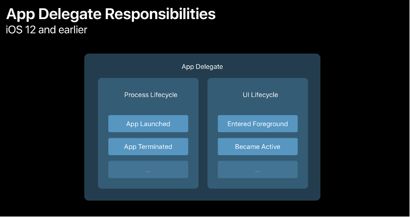
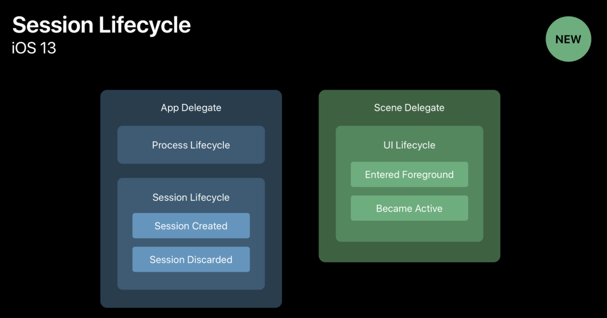

## AppDelegate 에 대해 설명하시오.

### UIApplication

iOS 에서 앱을 실행하면 UIApplicationMain(_:_:_:_:) 혹은 @main 으로 표현되는 main 함수를 실행하게 됩니다. 이는 앱의 Entry point 로서 signleton UIApplication 객체를 생성하게 되며 shared 라는 signleton 변수로 접근이 가능합니다.

위에서 생성한 UIApplication 은 앱의 동작과 사용자의 이벤트를 다룹니다.

* 사용자의 액션을 정의하는 UIControl 클래스를 적절한 target 객체에 전달합니다.
* 화면에 필요한 UIView 객체를 windows 객체들로부터 전달받습니다.

대부분 개발자들은 이 객체를 이용하지 않지만 특별한 상황에서는 반드시 필요한 객체입니다.

* `beginIgnoringInteractionEvents()` **유저 이벤트**를 일정 시간동안 정지 시킴.
* `registerForRemoteNotifications()` 외부 **알림**을 등록함.
* `applicationSupportsShakeToEdit` undo-redo 를 활성화함.
* `canOpenURL(_:)` URL scheme 에 등록된 애플리케이션이 존재하는지 판단함.
* `beginBackgroundTask(expirationHandler:)` 앱이 background **상태**에서도 작업을 지속하여 수행할 수 있도록 함.
* `scheduleLocalNotification(_:)` `cancelLocalNotification(_:)` 알림을 등록하거나 취소함.
* `beginReceivingRemoteControlEvents()` `endReceivingRemoteControlEvents()` **원격 제어**를 관리함.
* 앱의 상태를 복구함.

### UIApplicationDelegate

위에서 설명한 UIApplication 객체는 UIApplicationDelegate 를 구현한 객체를 자신의 delegate 로 참조할 수 있습니다.

UIApplication 이 이벤트를 처리한 뒤 그 사실을 UIApplicationDelegate 를 구현한 자신의 delegate 에게 Delegate Pattern 을 통해서 notify 하는 것입니다.

* 애플리케이션 실행 완료
* 메모리 이슈
* 애플리케이션 종료
* email, image, (실행 가능한)resource 을 실행해야 해서 다른 앱을 열어야 함

UIApplication 의 delegate(UIApplicationDelegate 구현) 는 위와 같은 이벤트에 대한 대처를 마련하기에 적합한 객체가 됩니다.

UIApplicationDelegate 에는 UIApplication 의 이벤트에 따라 실행되는 메소드들이 마련되어 있습니다. 사실상 UIApplication 의 상태에 따라 실행되는 메소드이기 때문에 이 프로토콜을 구현한 객체는 앱의 root object 역할을 하게 됩니다. 이 객체를 활용하여 다음의 작업을 할 수 있습니다.

* 앱의 데이터 구조 초기화
* 앱의 Scene 관리
* 외부에서 실행된 앱 혹은 현재 앱의 알림 처리
* APNs(Apple Push Notification service) 등록

이 객체를 최초로 만드는 주체는 UIKit 입니다. 앱이 실행되는 동안은 항상 존재하고 있습니다.

### AppDelegate

즉, AppDelegate 는 현재 실행중인 앱을 대표하는 UIApplication 객체의 delegate 인 UIApplicationDelegate 프로토콜을 구현한 객체입니다.

앱의 라이프사이클 변화와 상태변화에 따른 대응이 가능하고, 외부의 이슈나 알림 등에도 대응을 할 수 있기 때문에 Low-Level 의 작업에도 적합한 객체입니다.(예: 백업, 알림 처리, 외부 앱 실행)

AppDelegate 를 생성하면 window 프로퍼티가 존재하는데, window 는 모든 뷰의 최초 뷰 혹은 상위의 뷰를 뜻한다.

### AppDelegate 상태변화 메소드

AppDelegate 는 앱의 상태변화에 따른 앱의 동작을 정의합니다. 여기서 말하는 상태란 4개가 존재합니다.

* Foreground (Active + Inactive)
* Background
* Unattached
* Suspended

이 상태변화에 따른 상태변화 메소드는 아래와 같습니다.

* `application(_:UIApplication,willFinishLaunchingWithOptions:[UIApplicationLaunchOptionsKey: Any]? = nil) -> Bool`
  * App 의 실행 프로세스가 최초 실행될 때 호출되는 메소드이다.
* `application(_:UIApplication,didFinishLaunchingWithOptions:[UIApplicationLaunchOptionsKey: Any]?) -> Bool`
  * App 실행 프로세스가 종료되었을 때 실행되는 메소드이다. 앱 실행 준비가 완료되었음을 뜻한다.
* `applicationWillResignActive(_application:UIApplication)`
  * InActive 상태로 전환되기 직전 호출된다.
* `applicationDidEnterBackground(_application:UIApplication)`
  * Background 상태로 전환되기 직전 호출된다.
* `applicationWillEnterForeground(_application:UIApplication)`
  * Active 상태가 되기 직전, 화면에 보여지기 직전 호출됨.
* `applicationDidBecomeActive(_application:UIApplication)`
  * Active 상태로 전환된 직후 호출
* `applicationWillTerminate(_application:UIApplication)`
  * App 이 종료되기 직전에 호출
* `open(_:options:completionHandler)`

---

## SceneDelegate 에 대해 설명하시오.

### UIScene

한 애플리케이션의 UI 를 앱 혹은 사용자가 호출 가능하도록 만들어진 UI 객체입니다. 줄여서 scene 객체라고도 합니다.

scene 객체의 동작에 따른 delegate 객체를 반영할 수 있는데 UISceneDelegate 프로토콜을 채택해야 합니다. scene 의 상태변화를 감지하여 delegate 객체는 delegate 패턴에 따라 여러 메소드를 실행시킵니다.

### UISceneDelegate

Scene 에서 발생하는 라이프사이클 관련 이벤트를 처리하기 위한 델리게이트 객체입니다. iOS 12 까지는 UIApplication 의 모든 이벤트와 관련된 역할을 AppDelegate 객체가 하였지만, 이 역할 중 UI 와 관련된 부분을 분리하여 받았습니다.

위의 그림에서 보이는 것과 같이 앱의 상태가 변화할 경우 그에 반응하는 델리게이트 객체 입니다. 

SceneDelegate 를 사용하는 이유 중 하나는 iOS 및 iPadOS 의 다중 창 앱 빌드를 하기 위함입니다. SceneDelegate 로 인해 Scene Session 라는 개념이 생겨나면서 iPad 에서는 여러 개의 앱을 동시에 실행하는 것이 가능해졌습니다.

iOS 13 이전에는 AppDelegate 의 window 변수(첫번째 생성되는 부모 view)가 SceneDelegate 의 scene 으로 대체됩니다.

아래는 SceneDelegate 가 앱의 상태변화에 따라 실행하는 다양한 메소드들입니다.

* `scene(_:willConnectTo:options:)`
  * scene 이 앱에 추가될 때 호출.
* `sceneDidDisconnect(_:)`
  * scene 의 연결이 해제될 때 호출. 재 연결도 가능하다.
* `sceneDidBecomeActive(_:)`
  * app Switcher 에서 선택되거나, scene 간의 상호작용에 의해 호출.
* `sceneWillResignActive(_:)`
  * scene 과 사용자의 상호자가용이 중지될 때 호출.
* `sceneWillEnterForeground(_:)`
  * scene 이 foreground 에 진입할 때 호출.
* `sceneDidEnterBackground(_:)`
  * scene 이 백그라운드로 진입할 때 호출.

### UIWindowSceneDelegate

iOS 13 부터 UI 를 대표하는 객체인 scene 의 라이프사이클을 관리하는 데 유용한 여러 메소드들을 구현하는 객체들의 프로토콜입니다.

SceneDelegate 객체가 구현하고 있는 프로토콜입니다.

이 프로토콜을 통해 단순히 상태 변화를 감지하여 메소드를 실행하는 것 뿐만 아니라, scene 의 크기 변화가 일어났을 때 필요한 동작들도 수행할 수 있다.

Reference:
* [Apple Documentation - UIApplication](https://developer.apple.com/documentation/uikit/uiapplication)
* [Apple Documentation - UIApplicationDelegate](https://developer.apple.com/documentation/uikit/uiapplicationdelegate)
* [Apple Documentation - UISceneDelegate](https://developer.apple.com/documentation/uikit/uiscenedelegate/)
* [Apple Documentation - UIWindowSceneDelegate](https://developer.apple.com/documentation/uikit/uiwindowscenedelegate)
* [Apple Documentation - UIWindowScene](https://developer.apple.com/documentation/uikit/uiwindowscene)
* [Apple Documentation - UIScene](https://developer.apple.com/documentation/uikit/uiscene)