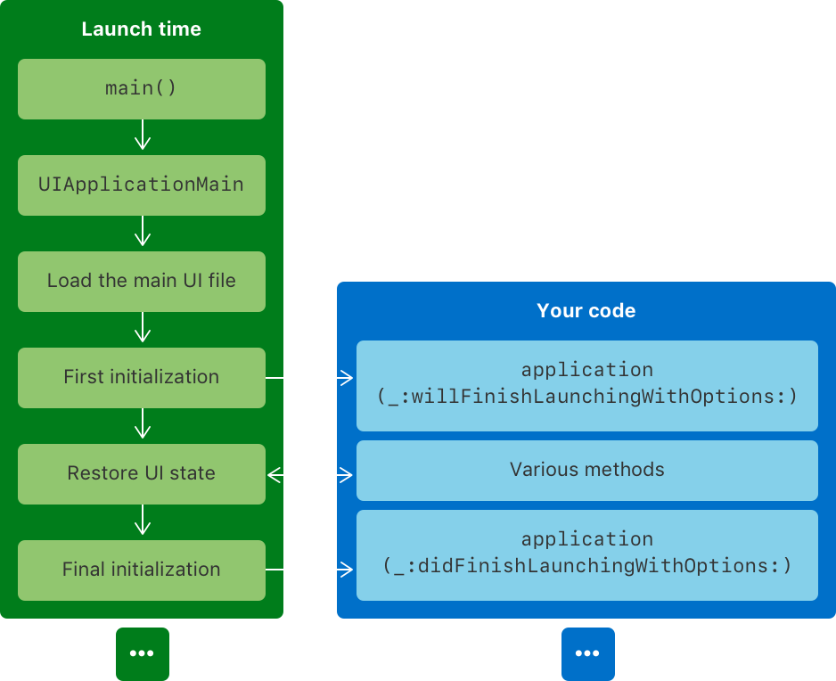

# About the app launch sequence

> 애플의 공식문서를 그대로 읽고 번역본을 업로드 합니다.

## OverView

앱을 실행시킨다는 것은 복잡한 과정을 내포하고 있고, 대부분의 과정은 시스템에 의해 자동으로 제어되고 있습니다. 앱 실행 중에 UIKit 은 AppDelegate 메소드를 실행시켜서 당신이 앱의 User Interaction, App Requirement 에 해당하는 여러 작업들을 수행할 수 있도록 합니다. 아래 그림은 앱이 실행되는 순간부터 실행 과정이 종료되기까지 일련의 과정을 보여주고 있습니다.

1. 사용자나 시스템이 당신의 앱을 실행합니다. 아니면 시스템이 미리 앱을 Prewarm 시켜 놓습니다. 자세한 사항은 [Prepare your app for prewarming](https://developer.apple.com/documentation/uikit/app_and_environment/responding_to_the_launch_of_your_app/about_the_app_launch_sequence#3894431) 을 참고하세요.
2. 시스템은 Xcode 가 제공하는 main() 함수를 실행시킵니다.
3. main() 함수는 UIApplicationMain 함수를 호출하여 UIApplication 객체를 생성합니다.
4. UIKit 은 Info.plist 파일이나 Build Target 의 커스텀 iOS Target 마다 정의되는 iOS Target Properties 를 통해 정의된 기본 스토리보드를 불러옵니다. 기본 스토리보드를 정의하지 않은 앱은 이 단계를 넘깁니다.
5. UIKit 은 application(_:willFinishLaunchingWithOptions:) 메소드를 AppDelegate 에서 실행시킵니다.
6. UIKit 은 상태 복구 작업을 수행합니다. 이런 작업을 통해 AppDelegate 의 추가적인 메소드와 앱의 ViewController 실행을 가능케 합니다. 더 자세한 사항은 [About the UI restoration process](https://developer.apple.com/documentation/uikit/app_and_environment/responding_to_the_launch_of_your_app/about_the_app_launch_sequence#:~:text=About%20the%20UI%20restoration%20process) 를 참고하세요.
7. UIKit 은 AppDelegate 의 application(_:didFinishLaunchingWithOptions:) 메소드를 실행시킵니다.

앱 실행 과정이 끝나면 시스템은 AppDelegate 혹은 SceneDelegate 에게 앱의 UI 를 보여주도록 시키고, 앱의 LifeCycle 을 관리하도록 지시합니다.

---

## Prepare your app for prewarming

iOS 15 이후 기기의 상태에 따라 시스템은 종종 앱을 prewarm 시킵니다. 이는 앱이 사용되기 전에 non-running 상태의 애플리케이션 프로세스를 실행시켜서 실행 시 소모되는 자원이나 사용자의 대기 시간을 줄여줍니다. Prewarming 은 앱의 실행 과정을 main() 함수를 실행하여 UIApplicationMain 함수를 실행하기 전까지만 수행합니다. 이를 통해 시스템이 전체 실행 시 예상되는 빌드/Low-Level 구조 캐싱을 미리 할 수 있도록 합니다.

> 시스템이 앱을 실행할 때 요구하는 Low-Level 구조에 대한 더 자세한 정보는 WWDC 세션 비디오인 [App Startup Time: Past, Present, and Future](https://developer.apple.com/documentation/uikit/app_and_environment/responding_to_the_launch_of_your_app/about_the_app_launch_sequence#:~:text=App%20Startup%20Time%3A%20Past%2C%20Present%2C%20and%20Future) 를 참고하세요.

시스템이 앱을 prewarm 하고 나면, 앱 실행 과정은 중지 상태로 남아서 앱이 실행될때까지는 재개되지 않습니다. 그렇지 않을 경우 시스템은 prewarm 된 앱을 메모리에서 해제시키도록 요청합니다. 시스템은 앱을 기기의 재부팅과 주기적인 타이밍마다 시스템이 가능한만큼 앱을 prewarm 할 수 있습니다.

만약 앱이 UIApplicationMain 함수가 실행되기 전에 코드를 실행한다면 (정적 생성자인 load() 처럼) 특정 서비스나 자원을 사용할 수 있을거라고 가정하면 안됩니다. 예를 들어, 기기를 잠금 해제하는 데 필요한 data protection policies 에서 요구하는 keychain item 들은 사용할 수 없는 것입니다. 만약 당신의 코드가 특정 서비스나 자원에 종속적이라면, 실행 과정 뒤에 실행되도록 migrate 하시기 바랍니다.

앱 Prewarming 은 prewarming 이 시작되고 나서부터, 사용자나 시스템이 앱을 실행하기까지 정확하지 않은 만큼의 시간을 소요합니다. 그렇기 때문에, 직접 다양한 상황에서의 앱 실행과정에 대한 실행 시간을 입력하기보다 MetricKit 을 이용하여 user-driven 실행시간을 측정하십시오. 

## Summary

1.	main 함수 실행 후 @UIApplicationMain 함수를 호출 함.
2.	@UIApplicationMain 함수에 의해 UIApplication 객체를 생성함. UIApplication 객체는 앱의 본체에 해당한다.
3.	nib 파일, info.plist 등 파일을 읽어들여 앱 실행에 필요한 데이터를 로드한다.
4.	AppDelegate, SceneDelegate 를 만들고 UIApplication 객체와 연결된 런 루프를 만드는 등 실행에 필요한 준비를 한다.
5.	AppDelegate 의 application(_application:UIApplication, didFinishLaunchingWithOptions launchOptions: [UIApplicationLaunchOptionsKey: Any]?) -> Bool 을 실행한다.

Reference: 

[//]: # (* [Apple Documentation - Responding to the launch of your app]&#40;https://developer.apple.com/documentation/uikit/app_and_environment/responding_to_the_launch_of_your_app&#41;)
* [Apple Documentation - About the app launch sequence](https://developer.apple.com/documentation/uikit/app_and_environment/responding_to_the_launch_of_your_app/about_the_app_launch_sequence)