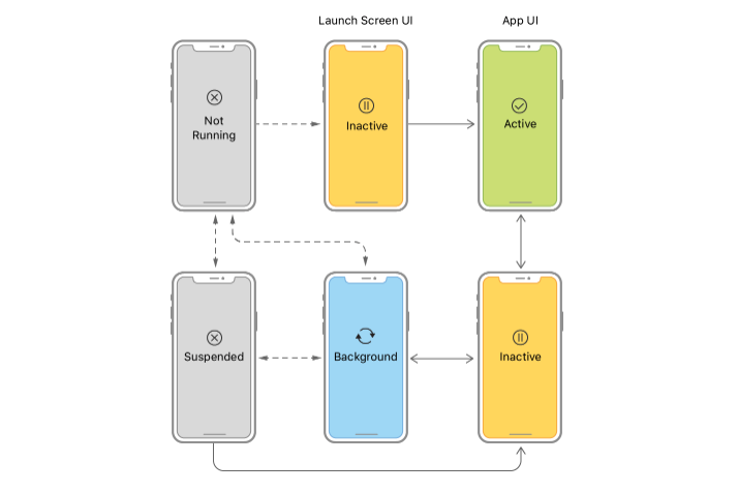

앱이 In-Active 상태가 되는 시나리오를 설명하시오.

Foreground 는 Inactive + Active 를 합친 것을 말한다.
이 중 Active 인 경우는 흔히 우리가 앱을 사용하는 상태를 말한다. iPhone 의 많은 자원을 사용할 수 있다.
Inactive 상태는 Active 상태에서 유저 이벤트는 받지 않는 일시적인 상태이다.
만약 Foreground 상태에서 전화나 메시지 등을 받으면 일시적으로 Interrupt 가 발생한다.
Background 는 앱이 홈 버튼 혹은 슬라이드를 통해 화면에서 사라진 상태를 말한다.
전화나 알림등으로 인한 일시적인 멈춤은 App Switcher 에 의해 Suspended 상태로의 변환을 유도한다.

---

앱이 foreground에 있을 때와 background에 있을 때 어떤 제약사항이 있나요?

background에 있는 경우 메모리에서 해제될 수 있다.
foreground에 있는 앱은 우선순위가 높아서 OS가 가진 자원을 많이 사용할 수 있다. background 에서는 실행할 수 있는 동작이 많이 제한되는데 Notifications, Audio, Bluetooth 등의 작업은 가능하다.
background에 있는 앱의 경우는 언제든 자원이 부족할 경우 종료될 수 있다.
AppDelegate 의 window객체나 UIKit 에서 객체를 반환하는 작업 등은 background에서 불가능하다.
