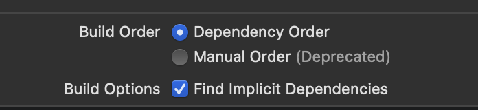
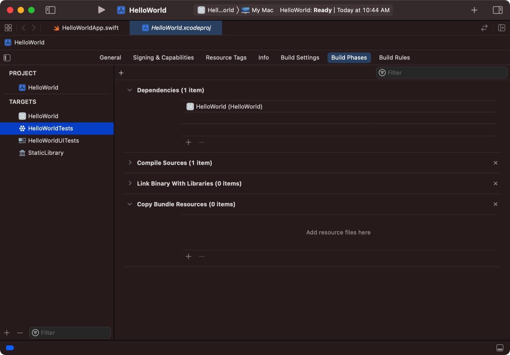

# Xcode 개발 환경에서의 Target, Project, Workspace 의 차이를 설명하시오.

> target +-- project +-- Workspace

## Target (Build Target)

- project 혹은 Workspace 에서 빌드하는 설정과 절차를 포함하는 관리의 최소 단위. 하나의 product 를 의미합니다.
- 빌드에 필요한 소스 파일, build settings, build phases, dependencies 등을 관리합니다.
- build setting 의 경우 Project 에서 상속받을 수 있지만, Target 레벨에서 직접 설정하면 override 하는 효과를 얻을 수 있습니다.
- target 끼리는 의존성을 가질 수 있습니다. A target 이 빌드하는 데 B target 이 필요하게 셋팅할 수 있습니다.
- implicit dependency(내부, 잠재적 의존성) 는 Xcode 가 자동으로 의존성을 인식하고 순서대로 target 을 빌드하도록 하는 것을 말합니다.
  - Xcode 가 dependencies 간의 의존성을 감지하도록 하려면 scheme 설정을 해줘야 합니다.
  - 설정은 [Product]-[Scheme]-[Edit Scheme]-[Build 탭] 에서 확인할 수 있습니다.

- explicit dependency(외부, 외적인 의존성) 는 Xcode build phases 를 통해 설정 가능합니다.
  - [project 파일]-[build phases]-[Dependencies] 혹은 [Target Dependencies] 에서 [+] 버튼을 이용하여 외부 target 을 추가할 수 있습니다.
  - 추가된 target 은 현재 설정한 target 이 빌드되기 전에 빌드됩니다.

- 대부분의 의존성은 Xcode 가 자동으로 감지할 수 있지만, 외부의 target 을 추가하려면 explicit dependency 설정을 해야 합니다.

## Project

- 소프트웨어 제품들을 위한 모든 정보를 포함하고 있습니다.
- project 는 모든 빌드에 필요한 모든 요소들을 소유하고 각 요소의 관계를 관리합니다.
  - 여기서 말하는 빌드에 필요한 요소의 대표적인 것은 target(하나 혹은 그 이상) 입니다.
  - project 는 모든 타겟들을 위한 build settings 를 가집니다. 이 설정값은 그대로 target 에 적용되거나 target 자체적으로 override 합니다.
- project 의 상세한 구조는 다음과 같습니다. 소스코드, 그룹(디렉토리), 프로젝트 빌드 설정(build config), 타겟들, 실행 환경값을 포함합니다.

| 이름                                           | 설명                                                                        |
|----------------------------------------------|---------------------------------------------------------------------------|
| Reference to source files (소스 파일 간 참조관계) | 소스코드(.swift, .m. .h) 내/외부 라이브러리, 프레임워크 리소스, 이미지, 인터페이스 빌더 파일  |
| Groups                                       | 소스파일들의 구조를 정의함                                                            |
| Project-level build configurations           | 프로젝트 전용 build configuration 파일들을 정의할 수 있습니다. 예를 들어 debug/release 관련 빌드 설정 |
| Targets                                      | target 에는 관계있는 target 간 의존관계, 소스파일 참조관계, 자체 빌드 설정 들이 정의되어 있습니다.           |
| executable environments                      | run/debug/Command-line arguments/Environmental variables 들을 포함합니다.        |

- project 는 그 자체만으로도 애플리케이션이 될 수 있지만, workspace 에 포함되는 것도 가능합니다.

## Workspace

- project 의 container 입니다. workspace document 는 포함된 project 들과 파일들의 포인터를 저장하고 있습니다.
- project 간 implicit/explicit 한 관계를 제공하기도 합니다.
- project 뿐 아니라 필요한 어떤 파일이든 포함 가능합니다.
- project 는 무조건 한 개 이상의 workspace 에 포함되게 됩니다.
- Xcode 4 부터 등장한 개념입니다.
  - 이전에는 project 간의 관계는 project 끼리 관리해서 복잡했습니다.
  - 이제는 workspace 내에서 관리되기 때문에 Code Completion, Jump to Definition, content 관련 기능들을 부드럽게 실행할 수 있습니다.
- 같은 workspace 를 공유하는 project 는 build directory 를 공유합니다. (workspace build directory)
  - workspace build directory 에 모든 project 들이 포함되면 모든 project 가 사용하는 라이브러리를 각각 빌드에서 포함시킬 필요가 없습니다.
  - Xcode 는 workspace build directory 를 토대로 implicit dependencies 를 파악합니다.
  - workspace build directory 는 설정 가능합니다.

Reference:
* [Apple Documentation - Xcode Target](https://developer.apple.com/library/archive/featuredarticles/XcodeConcepts/Concept-Targets.html#//apple_ref/doc/uid/TP40009328-CH4-SW1)
* [Apple Documentation - Xcode Project](https://developer.apple.com/library/archive/featuredarticles/XcodeConcepts/Concept-Projects.html#//apple_ref/doc/uid/TP40009328-CH5-SW1)
* [Apple Documentation - Build Setting](https://developer.apple.com/library/archive/featuredarticles/XcodeConcepts/Concept-Build_Settings.html#//apple_ref/doc/uid/TP40009328-CH6-SW1)
* [Apple Documentation - Xcode Workspace](https://developer.apple.com/library/archive/featuredarticles/XcodeConcepts/Concept-Workspace.html#//apple_ref/doc/uid/TP40009328-CH7-SW1)
* [Managing multiple projects and their dependencies](https://developer.apple.com/documentation/xcode/managing-multiple-projects-and-their-dependencies?changes=_8)
* [Apple Documentation - Xcode Scheme](https://developer.apple.com/library/archive/featuredarticles/XcodeConcepts/Concept-Schemes.html#//apple_ref/doc/uid/TP40009328-CH8-SW1)
* [Apple Documentation - Customizing the build phases of a target](https://developer.apple.com/documentation/xcode/customizing-the-build-phases-of-a-target)
* [Apple Documentation - Configuring a new target in your project](https://developer.apple.com/documentation/xcode/configuring-a-new-target-in-your-project)