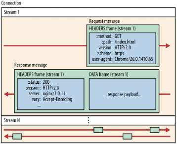

# HTTP 2

## HTTP 1.1 까지의 상황

HTTP 1.1 의 성공은 HTTP Protocol 을 범용적인 프로토콜로 만들어 주었습니다. RFC 1945 에서의 60 페이지 짜리 기술은 RFC 2616 에서 176 페이지로 늘어날 정도로 확대될 정도이니 말입니다.

HTTP 1.1 의 대표적인 단점은 **파이프라이닝** 입니다. 앞의 요청이 굉장히 성가시다는 판단을 미리 해서 Server Application 에서 컨트롤 한다는 것은 굉장히 어려운 일입니다. 그렇기 때문에 기본적으로 웹 브라우저들은 '파이프라인 사용 안함' 옵션을 기본값으로 설정해 놓습니다.

```
HTTP/1.0은 기본적으로 Connection 하나 당 하나의 요청을 처리할 수 있다.
동시전송이 필요한 멀티미디어 리소스들이 있는 상황에서는 Network Latency를 발생시키게 마련이다.
그래서 HTTP 는 Pipelineing 을 통해 하나의 TCP 에 두 개 이상의 HTTP 요청을 담아 Network Latency를 줄이는 시도를 하였다.
정확한 구현이 어렵고, HOL Blocking 이 발생한다는 단점이 있다.

* HOL Blocking = Head Of Line Blocking. 
  앞선 요청에 지연이 발생하면 뒤의 요청도 지연되는 현상을 말함. 
  서버는 TCP에서 요청받은 순서대로 응답을 한다.
```

또한 TCP 의 장점을 활용하는 데 있어서도 많은 난관이 있었습니다. 본래 가지고 있던 능력, 퍼포먼스가 현재로서는 부족한 혹은 효율적이지 않은 것입니다.

결국 대기시간에 대해 효율적인 대처를 하지 못하는 상황에서 비디오, 게임 등에서 HTTP 1.1 은 문제가 되고 있습니다.

문제를 해결하려는 아래와 같은 시도도 있었습니다. 몇몇은 훌륭했고 몇몇은 쓸모 없었습니다.

* Spriting
  * 개별 이미지를 하나의 큰 이미지로 합치는 것을 의미한다.
  * 여러번의 연결이 필요하지 않아 속도 면에서 유용할 수 있다.
  * 하지만 큰 이미지에 포함된 개별 이미지 중 여러번 사용되는 이미지가 포함될 경우 속도면에서 불리해질 수 있고, 이미지들은 캐시가 정리될 때 같이 정리되기도 한다.
* Inlining
  * 이미지를 직접 전송하기보다는 URL 을 포함한 CSS 파일로 전달하는 방법이다.
  * Spriting 과 동일한 문제점을 갖는다.
* Concatenation
  * 거대한 웹 화면일 수록 수많은 JS 파일을 갖는데, 이를 하나의 JS 로 병합하는 것을 말한다.
  * 재실행 되는 코드가 많다는 문제가 있다.
* Sharding
  * 서비스가 가능한 한 다양한 종류의 호스트들을 서비스하는 것을 뜻한다.
  * HTTP 1.1 명세는 클라이언트가 호스트 당 2 개(현재는 6~8 로 늘어남)의 TCP 연결만을 허용하도록 한다. 그러므로, 많은 Host-Name 만 있다면 웹 페이지에 대한 여러 개의 연결에 대해 많은 시간단축을 기대할 수 있다.
  * httparchive.org 의 연구에 따르면 웹 서비스를 운영하는데 사용되는 연결의 갯수는 계속 증가하는 추세라고 한다.

## Updating HTTP

HTTP 1.1 에서 개선되어야 할 사항들은 다음과 같았습니다.

* latency 를 줄여야 합니다.
* 파이프라이닝 문제를 해결해야 합니다.
* 각 Host 에 증가하고 있는 연결의 갯수를 줄여야 합니다.
* 현재 사용하는 인터페이스, 컨텐츠, URI 포맷, URI 스키마 들은 유지합니다.
* IETF 에서 만들어져야 합니다.

IETF 란 인터넷 프로토콜 레벨에서 인터넷 표준과 발전을 장려하기 위해 활동하는 기관입니다. HTTP 말고도 FTP, DNS, TCP 등 모든 것에 대한 문서화도 진행합니다.


류인 HTTP 1.1의 상위버전으로, 인터넷 기술의 표준화를 주도하는 IETF에 의해 2015년 발표되었다. 정확한 명세는 RFD 7540 에 명시되어 있다. 구글의 SPDY에 기반하고 있다.

목표

클라이언트와 서버가 HTTP/1.0, 2.0 혹은 다른 프로토콜 사용을 자유롭게 오고갈 수 있는 메커니즘 구현
HTTP/1.1과 호환성 유지
다음의 방법들을 이용하여 지연시간을 감소시키고 웹 브라우저 페이지 로드 속도 개선
- HTTP Header 데이터 압축
- 서버 푸시 기술
- 요청을 HTTP 파이프라인으로 처리
- HTTP/1.x의 HOL blocking 문제 해결
- TCP 연결 하나로 여러 요청을 다중화 처리
데스크탑 브라우저, 모바일 웹 브라우저, 웹 API, 웹 서버, 프록시 서버, 리버스 프록시 서버, 방화벽, 콘텐츠 전송 네트워크 등 자주 쓰이는 것들을 지원

HTTP/1.1 의 문제점

HTTP Pipelining

무거운 Header
클라이언트/서버 간에는 수많은 HTTP 요청이 발생할 것이고 Header 정보는 대부분 동일할 것이다. 하지만 HTTP/1.1에서는 Header를 중복으로 보내고 Cookie도 매 요청마다 Header에 포함되어 전송된다. 불필요한 데이터를 주고받는 데 네트워크 자원이 소비되고 있다.

새로운 개념들

HTTP/1.1에서는 평문을 사용하고 개행을 통해 구별하는 것과 달리 HTTP/2.0에서는 바이너리 포맷으로 인코딩 된 Message, Frame을 사용한다.

Stream = 구성된 연결 내에서 전달되는 바이트의 양방향 흐름. 하나 이상의 메시지가 전달 가능하다.
Message = 논리적 요청 또는 응답 메시지에 매핑되는 프레임의 전체 시퀀스를 뜻한다.
Frame = HTTP/2.0 에서 통신의 최소 단위. 각 최소 단위에는 하나의 프레임 헤더가 포함된다. 이 프레임 헤더는 최소한으로 프레임이 속하는 스트림을 식별한다. HEADERS Type Frame, DATA Type Frame으로 나뉜다.



https://velog.io/@taesunny/HTTP2HTTP-2.0-%EC%A0%95%EB%A6%AC

Reference:
* [HTTP2 explained(Korean)](https://http2-explained.haxx.se/ko)