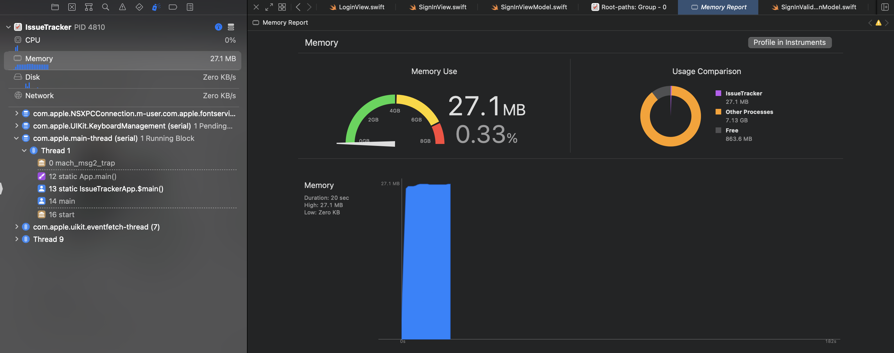

# Memory Leak 이란?

모든 프로그램에 의해 실행된 프로세스에게 있어 메모리는 한정된 자원입니다. 프로세스는 한정된 자원 안에서 작업을 수행해야 합니다. 만약 한정된 자원 이상을 사용하게 되면 백그라운드에 있던 앱이 종료되거나 현재 실행중인 앱도 종료될 수 있습니다.

`Memory Leak(메모리 누수) 는 프로세스가 사용하는 메모리를 제대로 관리하지 않아서 전체적인 메모리 사용량이 위험수준까지 증가하는 현상을 말합니다.` 이에 대한 대처는 운영체제마다 다르지만, iOS 의 경우 백그라운드에 있는 앱들에 메모리를 확보하라는 메시지를 보내거나 앱을 종료시켜버립니다.

Memory Leak 의 원인인 '관리되지 않은 메모리' 를 발생시키는 이유들은 매우 다양합니다.

## Memory Leak 을 발견하고 대처하는 방법

메모리 누수에는 주로 다음과 같은 원인이 있지 않은지 점검해볼 필요가 있습니다.

1. ARC 로 메모리가 처리되는 과정에 문제는 없는지. [ARC 에 대한 설명](https://github.com/SangHwi-Back/iOS-Interviews/LowLevel/ARC/AutoReferenceCounting.md)
2. Reference Count 가 줄어들지 않아 메모리가 계속 해제되지 않은채로 존재하고 있는지. [RC 에 대한 설명](https://github.com/SangHwi-Back/iOS-Interviews/LowLevel/ARC/ReferenceCount.md)

이와 같은 현상들로 인해 메모리가 상승하는 현상은 Xcode 를 이용하면 쉽게 파악이 가능합니다.

1. Xcode Debug Navigator, Memory Report 에서 현상을 확인해본다.
2. Xcode Analyzer 를 통해 코드의 문제점을 자동으로 분석해본다.
3. Xcode Memory Graph 를 사용하여 이상현상을 확인한다.
4. Xcode Instruments 를 사용하여 이상현상을 확인한다.

## Xcode Debug Navigator, Memory Report

가장 간단히 확인 가능한 방법 중 하나입니다.

1. Device 혹은 Simulator 로 앱을 실행시킨다.
2. Xcode 에서 Command+7 혹은 Project Navigator 를 통해 Debug Navigator 로 이동한다.
3. Memory 상승폭을 확인해본다. 특정 화면이나 이벤트에서 상승폭이 이상할 경우 해당하는 소스코드를 확인해본다.

메모리 게이지 중 노란 부분까지 메모리가 올라갔다면 위험상태입니다. 빨간색 부분까지 올라가게 된다면 iOS 에 의한 강제 종료가 될 가능성이 있습니다.

만약 iOS 에 의해 앱이 종료되는 현상이 지속적으로 발견된다면 그것은 메모리 사용량 때문입니다.

## Xcode Analyzer

Xcode-Product-Analyze 를 통하여 여러 문제점을 파악할 수 있는 기능입니다.

이 기능을 통해서 여러 문제점을 파악할 수 있습니다.

* 잠재적 Memory Leak
* 논리적인 오류가 있는 Code
* Optimization 이 필요한 Code
* 사용하지 않는 변수 선언

## Xcode Memory Graph

객체들에 할당된 메모리를 그래프 형태로 표시하는 Xcode 디버깅 기능의 하나입니다. 아래의 버튼을 통해 표시할 수 있으며, 앱이 실행중이어야 합니다.

위와 같이 메모리 그래프에서 문제가 발생한 경우 보라색 느낌표로 표시를 해줍니다.

만약 자신이 작업하지 않은 부분에서 오류가 발생한 것을 확인하였거나, 문제상황을 정확히 정의할 수 없을 경우에는 Xcode-File-Export Memory Graph 기능을 통해 현재 보고 있는 메모리 그래프를 팀원들과 공유할 수 있습니다.

## Xcode Instruments

Instruments 는 힙 메모리와 가상 메모리에 할당된 메모리의 크기를 표시하고 카테고리 별로 표시하는 데 특화되어 있습니다. 앱의 timeline 별로 메모리가 어떻게 변화하는지 확인하는 데 유용합니다.

Xcode-Product-Profile 메뉴를 통해 실행하거나, Memory Report 창에서 'Profile in Instruments' 버튼을 통해서도 실행할 수 있습니다.

Reference:

* [iOS 메모리 뜯어보기, 메모리 이슈 디버깅하기, 메모리 릭 찾기](https://seizze.github.io/2019/12/20/iOS-%EB%A9%94%EB%AA%A8%EB%A6%AC-%EB%9C%AF%EC%96%B4%EB%B3%B4%EA%B8%B0,-%EB%A9%94%EB%AA%A8%EB%A6%AC-%EC%9D%B4%EC%8A%88-%EB%94%94%EB%B2%84%EA%B9%85%ED%95%98%EA%B8%B0,-%EB%A9%94%EB%AA%A8%EB%A6%AC-%EB%A6%AD-%EC%B0%BE%EA%B8%B0.html)
* [Understanding memory leaks in closures](https://stremsdoerfer.medium.com/understanding-memory-leaks-in-closures-48207214cba)
* [Apple_Documentation_Gathering information about memory use](https://developer.apple.com/documentation/xcode/gathering-information-about-memory-use)
* [WWDC21 - Detect bugs early with the static analyzer](https://developer.apple.com/videos/play/wwdc2021/10202/)
* [WWDC18 - iOS Memory Deep Dive](https://developer.apple.com/documentation/xcode/gathering-information-about-memory-use)
* [WWDC19 - Getting Started with Instruments](https://developer.apple.com/videos/play/wwdc2019/411/)
* [iOS 프로그래밍팁 - Xcode Analyze 이용하기(정적 분석)](http://mtsparrow.blogspot.com/2013/04/ios-xcode-analyze.html)
* [\[번역\]iOS: Xcode의 메모리 그래프 디버거로 메모리 누수 식별하기](https://blog.canapio.com/130)